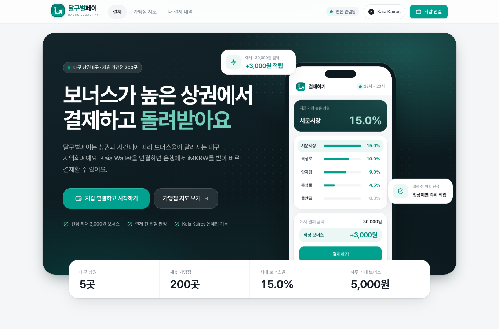
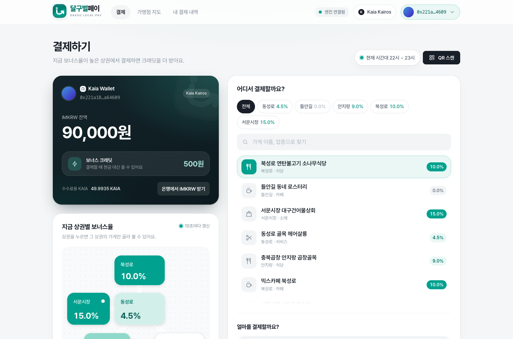
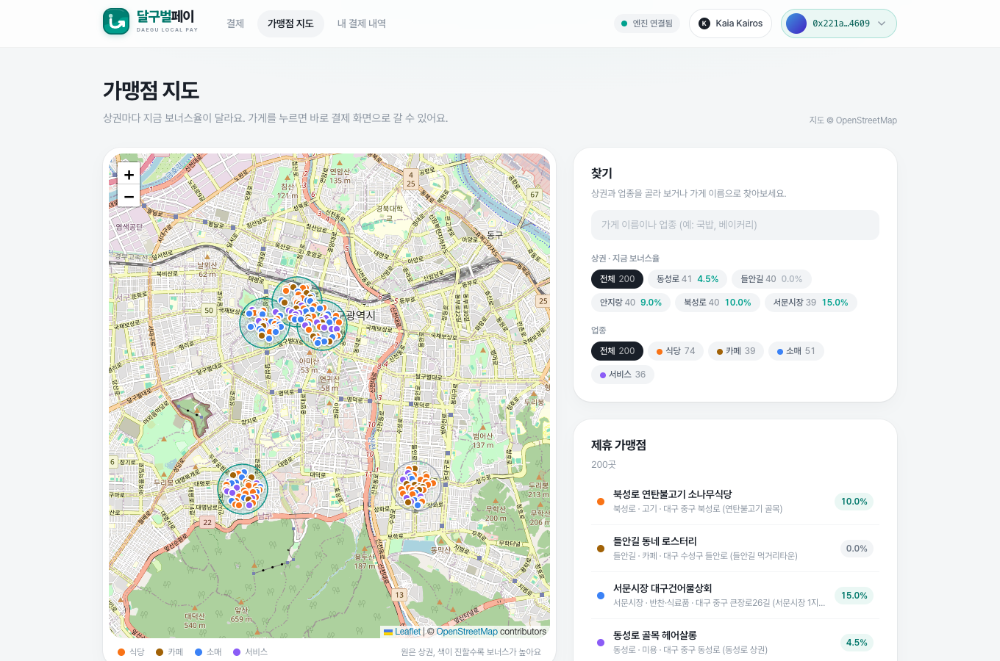
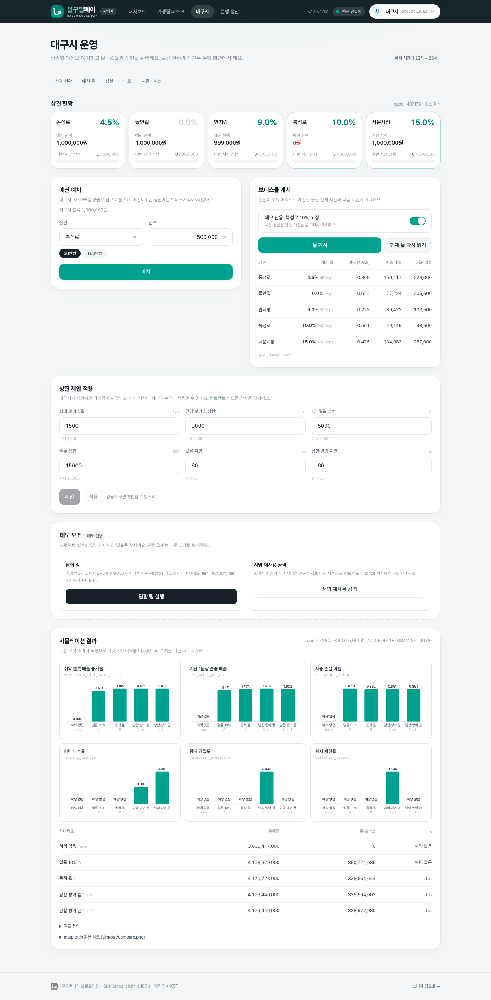
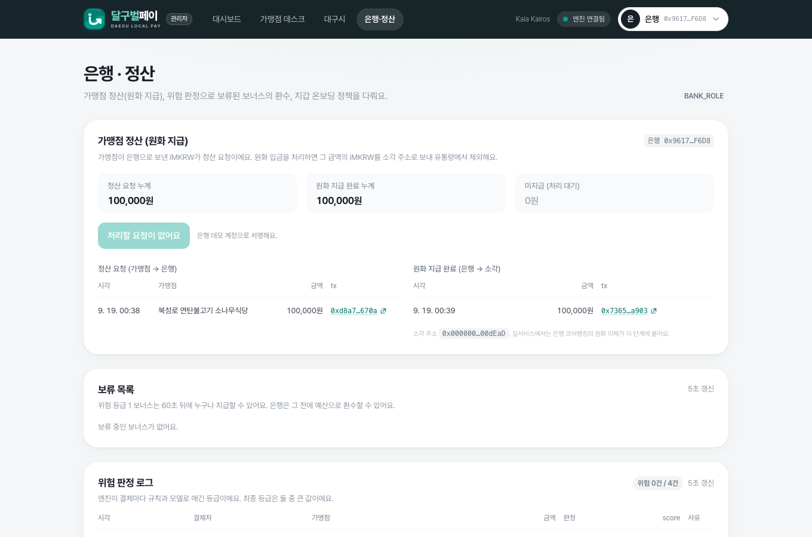

# 달구벌페이 (iM-LocalBoost)

> 손님이 뜸한 상권·시간대에 보너스를 더 주는 대구 지역화폐 결제 프로토타입. Kaia Kairos 테스트넷에서 동작합니다.



**이름**: 시민이 보는 서비스 이름은 "달구벌페이", 프로젝트·저장소 이름은 "iM-LocalBoost"입니다. 컨트랙트 `DalgubeolPay`와 저장소 `im-localboost`는 같은 제품을 가리킵니다.

## 무엇이 문제이고 무엇을 바꾸는가

지역화폐는 보통 "언제 어디서 쓰든 10%"처럼 일률 할인으로 운영됩니다. 이 방식에는 세 가지 약점이 있습니다.

1. **사중 손실**: 혜택이 없어도 일어났을 소비에 예산이 나갑니다. 이 저장소의 시뮬레이션에서는 일률 10% 예산의 86.9%가 그런 소비에 지급됐습니다.
2. **쏠림**: 이미 붐비는 상권과 시간대가 같은 율을 받으므로, 한산한 골목과 비수기 시간대를 살리는 데 예산을 집중할 수 없습니다.
3. **부정 수급(깡)**: 가맹점과 지인이 돈을 돌려 가며 결제해 보너스만 챙기는 담합을 사후 단속에 의존합니다.

달구벌페이는 세 가지를 바꿉니다.

- **동적 보너스율**: 엔진이 상권·시간대별 매출을 예측해 한산할수록, 취약 상권일수록 높은 율(0~15%)을 매시 정각 온체인에 게시합니다.
- **결제 시점 위험 판정**: 결제 직전에 규칙 4종과 LightGBM 모델이 담합 위험 등급을 매겨 EIP-712로 서명하고, 컨트랙트가 등급에 따라 보너스를 즉시 지급·보류·차단합니다.
- **결제는 막지 않는다**: 위험 등급이나 상한은 보너스만 줄입니다. 오탐이 나도 시민의 결제는 그대로 통과합니다.

역할은 넷입니다. **시민**은 본인 지갑으로 결제하고 크레딧을 받고, **가맹점**은 QR로 결제받고 정산을 요청하고, **대구시**는 상권 예산·율·상한을 관리하고, **은행(iM뱅크)** 은 iMKRW 발행·본인 확인·보류 보너스 환수·원화 정산을 맡습니다. 보너스 금액은 컨트랙트만 계산하므로 예산 집행 내역을 누구나 온체인에서 검증할 수 있습니다.

## 3분 둘러보기 (지갑 없이)

심사하시는 분이 지갑을 설치하지 않고도 핵심을 볼 수 있는 경로입니다. 관리자 도구는 상단에서 데모 계정을 고르면 바로 동작합니다.

1. https://im-localboost-web.vercel.app : 첫 화면에서 지금 상권별 보너스율을 확인합니다. "가맹점 지도 보기"로 가맹점 200곳과 상권별 율을 봅니다.
2. https://im-localboost-web.vercel.app/admin/city (데모 계정 "대구시"): 상권별 예산·율, 엔진의 수요 예측값, 하단의 "담합 링 실행"과 "서명 재사용 공격", 시뮬레이션 차트를 봅니다. 담합 링은 결제가 통과하면서 보너스만 0원이 되는 것을 보여 줍니다.
3. https://im-localboost-web.vercel.app/admin (대시보드): 전체 결제와 위험 판정 로그, 트랜잭션 링크를 봅니다.
4. https://im-localboost-web.vercel.app/admin/bank (데모 계정 "은행"): 정산, 보류 보너스 환수, 운영 계정 가스 잔액을 봅니다.

직접 결제해 보려면 Kaia Wallet(또는 MetaMask)을 설치하고 `/`에서 "지갑 연결" → "은행 등록하고 시작 자금 받기"를 누르세요. 은행이 iMKRW 100,000원과 수수료용 0.2 KAIA를 보내 주므로 faucet 없이 바로 결제할 수 있습니다. 은행 계정의 KAIA가 떨어진 경우에만 화면이 [Kaia faucet](https://faucet.kaia.io)을 안내합니다.

## 화면

| 시민: 결제 | 시민: 가맹점 지도 |
| --- | --- |
|  |  |

| 대구시: 예산·율·상한·시뮬레이션 | 은행: 정산·환수 |
| --- | --- |
|  |  |

모바일 화면과 나머지 관리자 화면은 `docs/demo/`에 있습니다(`consumer-home.png`, `consumer-history.png`, `admin-dashboard.png`, `admin-merchant.png`). 2026-09-19 프로덕션 데이터(Kairos)로 찍었습니다.

## 구조

```
                 ┌──────────────────────────┐
                 │  web (Next.js, Vercel)    │  소비자 앱: 본인 지갑(Kaia Wallet)으로 결제·QR·지도·내역
                 │                          │  관리자 도구(/admin): 대시보드·가맹점 데스크·대구시·은행/정산
                 └──────┬───────────┬───────┘
          /attest, /rates│           │ payWithBoost, deposit, publish
                         ▼           ▼
   ┌──────────────────────────┐   ┌──────────────────────────────────────┐
   │ engine (FastAPI, Railway) │   │ Kaia Kairos (chainId 1001)            │
   │ · 이벤트 폴러 → SQLite    │◄──│ MockIMKRW · MerchantRegistry ·        │
   │ · 규칙 4종 + LightGBM 위험 │   │ DalgubeolPay (율·예산·상한·보류·환수)   │
   │ · 수요 예측 → 율 게시     │──►│ 보너스 금액은 컨트랙트만 계산          │
   │ · EIP-712 Attestation 서명│   └──────────────────────────────────────┘
   └──────────────────────────┘
                 ▲
   sim (Python)  │ 같은 규칙·율 계산으로 5개 시나리오 비교 → web/public/sim
```

## 배포

| 대상 | 링크 |
| --- | --- |
| 웹 (소비자 앱) | https://im-localboost-web.vercel.app (`/` 결제, `/map` 가맹점 지도, `/history` 내 결제 내역, `/pay` QR 결제 화면) |
| 웹 (관리자 도구) | https://im-localboost-web.vercel.app/admin (`/admin` 대시보드, `/admin/merchant` 가맹점 데스크, `/admin/city` 대구시, `/admin/bank` 은행·정산) |
| 엔진 | https://engine-production-1edd.up.railway.app/health |
| MockIMKRW | https://kairos.kaiascan.io/address/0x0618ba0D361C5107bE2E39901dd394BFC4092A4b |
| MerchantRegistry | https://kairos.kaiascan.io/address/0xEB0aFb837B488e9713a825299F4DF6BB6D32Cc41 |
| DalgubeolPay | https://kairos.kaiascan.io/address/0x7ef0DA4bd695E91eAe9d53fb1Df18F302585258d |

배포 절차와 검증 기록은 `docs/deploy-kairos.md`, `docs/deploy-railway.md`, `docs/deploy-vercel.md`에 있습니다. Kairos 배포에서는 보류 지연 60초가 실제 시간이고, 공개 RPC라 트랜잭션 확인에 몇 초씩 걸립니다.

## 로컬 실행

Node 20+, Python 3.11, Docker(선택)가 필요합니다. 터미널을 세 개 씁니다.

```
make setup          # contracts/web npm install, 루트 .venv, .env·web/.env.local 복사
make node           # [터미널 1] Hardhat 로컬 노드 (chainId 31337)
make deploy-local   # 배포 + 시드, shared/deployments.json·abi 갱신
make train          # 합성 데이터 생성 → 위험 모델·수요 모델 학습 (지표는 나온 그대로 출력)
make engine         # [터미널 2] uvicorn engine.main:app (기본 8000)
make web            # [터미널 3] next dev (기본 3000)
```

로컬은 Hardhat 기본 계정을 씁니다(#0 deployer, #1 city, #2 bank, #3 oracle, #4 attester, #5~#9 소비자 1~5, #10~#12 가맹점 1~3). 비밀값은 `.env`에만 둡니다.

## 화면 구성

- **소비자 앱**은 본인 지갑으로만 동작합니다. 상단 "지갑 연결"에서 EIP-6963으로 감지된 지갑(Kaia Wallet, MetaMask 등)을 고르고, 체인이 다르면 빨간 "잘못된 네트워크" pill과 배너가 Kairos 전환을 안내합니다. 주소 메뉴에서 네트워크·가스 잔액·주소 복사·탐색기·faucet(테스트 KAIA)·연결 해제를 할 수 있습니다.
- **관리자 도구**(`/admin`)는 어두운 상단 바로 구분되며, 발표용 데모 계정(가맹점 1~3, 대구시, 은행, 소비자 1~5)은 여기서만 고를 수 있습니다. 소비자 1~5 데모 계정은 담합 링 같은 데모 보조 기능이 내부적으로 쓰는 키이며 소비자 앱에는 노출되지 않습니다.

## 데모 시나리오 (전체 흐름, 약 8분)

한 명의 시민(본인 지갑), 한 가맹점, 대구시, 은행이 등장합니다. 시드 직후 상태(북성로 예산 0, 오늘 결제 없음)를 전제하며, 하루 경계는 KST입니다. 데모 전 `make deploy-kairos` → `railway up --service engine --ci` → `make deploy-web …`로 새 시드를 만드세요.

| # | 누가 | 화면 | 하는 일 | 보여 주는 것 |
| --- | --- | --- | --- | --- |
| 1 | 대구시 | `/admin/city` | 북성로에 500,000원 예치 → "율 게시"(북성로 10% 고정 토글) | 상권 카드에 예산·율. 엔진이 현재·다음 시간 율을 온체인에 게시하고 이후 정시마다 자동 재게시 |
| 2 | 시민 | `/` | "지갑 연결" → Kaia Wallet 선택 → 승인 → (메인넷이면) 네트워크 전환 | 체인 pill "Kaia Kairos", 아바타+주소, 지갑 카드에 "은행 미등록" |
| 3 | 시민 | `/` | "은행 등록하고 시작 자금 받기" | 은행이 personId 연결·100,000원 발행·가스 지급(트랜잭션 3건 링크). 가스가 없으면 faucet 링크 |
| 4 | 시민 | `/map` | 지도에서 북성로 가게(소나무식당) 선택 → "결제 화면으로" | OSM 지도 위 상권별 현재 율, 가게 마커 |
| 5 | 가맹점 | `/admin/merchant` (가맹점 1) | "결제 QR": 10,000원 → QR 만들기 | QR(`/pay?m=&a=&r=`), 결제 대기 배지 |
| 6 | 시민 | 폰 카메라 또는 `/` "QR 스캔" | QR 찍기 → `/pay` → 결제 → 지갑에서 approve·서명 승인 | 결과 카드 "지급 · 보너스 1,000원", 크레딧 +1,000. 가맹점 화면은 5초 내 "결제가 들어왔어요" |
| 7 | 시민 | `/pay` 같은 가게 | 다시 10,000원 결제 | 성공, 보너스 0원, 사유 "오늘 이미 보너스를 받은 가게" (불변식 1: 결제는 막지 않음) |
| 8 | 시민 | `/` 다른 가게(믹스카페 북성로) | 크레딧 1,000원 사용해 10,000원 결제 | 현금분 9,000원에만 보너스 900원(불변식 4) |
| 9 | 시민 | `/history` | 내역 확인 | 결제 3건, 받은 보너스, 잔액·크레딧·가스 |
| 10 | 대구시 | `/admin/city` "데모 보조" | "담합 링 실행" | 위험 로그에 tier 2 "환류 + 모델 점수" 4건 즉시 차단(신규 지갑이라 모델이 0.9 이상). 결제는 통과, 보너스만 0 |
| 11 | 대구시 | 같은 곳 | "서명 재사용 공격" | `NonceUsed` revert. (서명이 만료 임박이면 새 결제를 먼저 만들어 항상 nonce 차단을 보여 줌) |
| 12 | 은행 | `/admin/bank` | 보류 목록 확인, (tier 1 건이 있으면) "환수" | 예산 복원. tier 1 흐름을 강제로 보려면 `demo-pay.ts TIER=1` |
| 13 | 가맹점 | `/admin/merchant` | "정산 요청": 받은 iMKRW 중 20,000원 → 은행으로 전송 | 내 정산 요청 목록에 tx |
| 14 | 은행 | `/admin/bank` | "원화 입금 처리" | 요청 누계·지급 완료·미지급이 갱신되고 같은 금액의 iMKRW가 소각 주소로 이동(유통량 정합) |
| 15 | 관리자 | `/admin` | 대시보드 | 오늘 결제 건수·금액·보너스·차단 건수, 전체 결제 표, 위험 로그, 엔진 블록 |
| 16 | 대구시 | `/admin/city` 하단 | 시뮬레이션 차트 | 5개 시나리오 지표 (`make sim` 결과 그대로) |

알아 둘 점:

- 10단계는 프로덕션에서 소비자 2~5가 전부 **tier 2**로 나옵니다(환류 규칙 tier 1 + 모델 0.947~0.989). 최종 등급은 규칙과 모델 중 큰 값입니다. 보류(tier 1) → 환수만 따로 보려면: `cd contracts && PAYER=2 MERCHANT=1 AMOUNT=10000 TIER=1 npx hardhat run scripts/demo-pay.ts --network localhost`.
- 위험 모델은 정시 직후 몇 초 안의 결제에 민감합니다(`secs_since_rate_change`). 웹은 매시 정각부터 45초까지 카운트다운 후 `/attest`를 부릅니다.
- 정산은 컨트랙트 변경 없이 ERC-20 transfer 두 번으로 표현합니다: 가맹점 → 은행(요청), 은행 → `0x…dEaD`(원화 지급 완료·유통 제외). 원장은 엔진 `/transfers`입니다.
- 브라우저 없이 핵심 결제 흐름을 검증: `cd web && npx tsx --env-file=.env.local scripts/demo-e2e.ts` (데모 계정 기준, 로컬). 지갑 흐름: `web/scripts/verify-wallet.ts`. `make test-integration`과 e2e는 각각 새 시드에서 시작하세요.

## 테스트

```
make test              # contracts: Hardhat 테스트 49개 (필수 케이스 case01~case16 + 매 시나리오 뒤 회계 등식 검사) + engine: pytest 49개 (통합 제외)
make test-integration  # 노드·엔진이 떠 있는 상태에서 엔진 서명 → 온체인 결제 → 재사용 revert 확인
cd web && npx tsx --env-file=.env.local scripts/verify-wallet.ts             # 일회용 키로 지갑 온보딩 → approve → 결제 (브라우저 없이)
cd web && npx tsx --env-file=.env.production.local scripts/verify-wallet.ts  # 같은 검증을 Kairos + Railway 상대로
```

필수 컨트랙트 케이스는 `contracts/test/dalgubeolpay.pay.test.ts`, `dalgubeolpay.admin.test.ts`, `registry.test.ts`에 `caseNN_` 이름으로 있습니다: 정상 결제, 서명 재제출·만료·위조·금액 불일치 revert, 같은 날 같은 가게 두 번째 결제(보너스 0), 1인 일일 상한, 슬롯 상한, 최대 율 초과 게시 revert, tier 1 보류·지급, 환수, tier 2 차단, 크레딧 결제, 예산 0 상권, 상한 변경 지연, 한 사람 두 지갑 revert. 불변식 5(회계 등식)는 모든 시나리오의 `afterEach`에서 검사합니다.

## 시뮬레이션

```
make sim   # sim/run.py --seed 7 --days 28 --consumers 5000 → sim/out/, web/public/sim/
```

소비자 5,000명, 상권 5개, 하루 14슬롯, 28일. 다항 로짓 `U = pref[z] - travel_cost[z] + sensitivity * benefit_rate[z,t]`에 "소비 안 함" 선택지를 포함합니다. 시나리오는 `none`(혜택 없음), `A`(일률 10%), `B`(동적 율, A와 총예산이 같도록 k 보정), `C_on`/`C_off`(B + 담합 링, 방어 켬/끔)입니다.

지표 정의 (`results.json.definitions` 그대로):

| 지표 | 정의 |
| --- | --- |
| `vulnerable_slot_sales_uplift` | 상권별로 `none` 매출 하위 25% (일, 슬롯) 셀에서 `(scenario - none) / none` |
| `net_sales_per_won` | `(total_sales - none.total_sales) / total_boost` |
| `deadweight_ratio` | `none`에서도 같은 상권·(일, 슬롯)에 구매했을 소비자에게 지급된 보너스 / total_boost |
| `farming_leakage` | 링 결제에 지급되고 회수되지 않은 보너스 / total_boost (C 시나리오) |
| `detection_precision` / `detection_recall` | C_on에서 규칙 tier ≥ 1 판정의 링 라벨 대비 정밀도 / 재현율 (전체 결제) |

결과 (`web/public/sim/results.json`, seed 7, 생성 2026-09-18T08:24:36+00:00, 수치를 고치지 않음):

| 시나리오 | 취약 슬롯 매출 증가율 | 예산 1원당 순증 매출 | 사중 손실 비율 | 파밍 누수율 | 탐지 정밀도 | 탐지 재현율 | 총매출 | 총 보너스 | k |
| --- | ---: | ---: | ---: | ---: | ---: | ---: | ---: | ---: | ---: |
| none | 0.000 | - | - | - | - | - | 3,636,417,000 | 0 | - |
| A | 0.173 | 1.547 | 0.869 | - | - | - | 4,178,929,000 | 350,721,035 | - |
| B | 0.185 | 1.578 | 0.852 | - | - | - | 4,170,723,000 | 338,564,644 | 1.5 |
| C_on | 0.185 | 1.618 | 0.851 | 0.001 | 0.040 | 0.635 | 4,179,446,000 | 335,594,003 | 1.5 |
| C_off | 0.185 | 1.602 | 0.851 | 0.001 | - | - | 4,179,446,000 | 338,977,980 | 1.5 |

읽는 법: 동적 율(B)은 일률 10%(A)보다 취약 슬롯 매출을 조금 더 올리고 사중 손실을 조금 줄였습니다. 방어를 켠 C_on의 탐지 정밀도 0.040은 규칙 계층만의 수치이며(모델 미포함), 정상 결제 가운데 환류·쌍 반복 규칙에 걸리는 오탐이 많다는 뜻입니다. 이 값을 조정하지 않았습니다.

학습 지표(`make train` 출력, `engine/models/*_metrics.json`): 위험 모델 validation precision@0.5 1.000, recall@0.5 0.911, AUC 1.000 (합성 데이터라 과대평가될 수 있음). 수요 모델 validation MAE 48,458원, 8~21시 MAPE 0.589.

## 설계 요약

**불변식 5개** (컨트랙트·엔진·웹이 모두 지킴):

1. 결제는 위험 등급이나 상한 때문에 revert하지 않는다. 줄어드는 것은 보너스뿐이다. revert 사유는 서명 불일치·만료·nonce 재사용·비활성 가맹점·미등록 결제자·잔액/allowance 부족뿐이다.
2. 보너스 금액은 컨트랙트만 계산한다. 서명에는 등급만 있고 금액·율이 없다.
3. 모든 개인 상한은 주소가 아니라 `personId` 단위다.
4. 크레딧으로 낸 금액에는 보너스가 붙지 않는다.
5. 회계 등식 `iMKRW.balanceOf(DalgubeolPay) == Σ zoneBudget + Σ credit + Σ pending(미처리)`가 모든 상태 변경 뒤에 성립한다.

**보너스 계산 순서** (`payWithBoost`, 어느 단계에서 0이 되어도 revert하지 않음):

1. `pairDay[personId][merchant] == 오늘`이면 보너스 0 (하루에 같은 가게 한 번)
2. 슬롯 상한: `base = min(amount - useCredit, slotBaseline × slotCapBps / 10000 - slotVolume[merchant][hour])`
3. `boost = base × rate[zone][hour] / 10000`
4. `boost = min(boost, 건당 상한, 1인 일일 상한 잔여, 상권 시간당 상한 잔여, 상권 예산)`
5. tier 2 → 0. tier 0 → 크레딧 즉시 적립. tier 1 → 보류(`pendingDelay` 후 지급, 은행이 환수 가능)

**위험 판정** (엔진 `/attest`, 최종 tier = max(규칙, 모델)):

| 규칙 | 조건 | tier |
| --- | --- | --- |
| 환류 `backflow` | 최근 24시간 Transfer 그래프에서 가맹점 → 결제자 경로가 3홉 이내 | 1 |
| 쌍 반복 `pair_repeat` | 같은 결제자·가맹점 쌍의 최근 7일 보너스 결제 ≥ 4회 | 1 |
| 신규 지갑 군집 `new_wallet_cluster` | 등록 48시간 이내 지갑 ≥ 5개가 같은 가맹점에 1시간 내 결제 | 2 |
| 매출 이탈 `sales_spike` | 가맹점 현재 슬롯 매출 > 기준 × 3 | 1 |

모델 계층은 LightGBM 이진 분류기(피처 11개, 학습·서빙이 같은 `engine/features.py`)이며 `score < 0.5 → 0`, `0.5~0.8 → 1`, `≥ 0.8 → 2`입니다.

**율 계산** (엔진 `/rates/publish`, zone × 1시간): LightGBM 회귀로 `predictedSales`, `baseline` = 같은 슬롯 최근 8주 상위 25% 평균, `slack = max(0, 1 - predictedSales / baseline)`, `bps = clip(round_to_50(k × slack × vulnerability[zone] × 10000), 0, 1500)`. `k`는 하루 한 번 `clamp(planned_spend / actual_spend, 0.5, 1.5)`로 보정하고, 슬롯의 10%는 `{0, 500, 1000, 1500}` 탐색값을 씁니다(overrides가 있는 상권 제외). 상한은 온체인 `caps().maxRateBps`를 읽어 적용하므로 대구시가 최대 율을 낮춰도 게시가 `RateTooHigh`로 막히지 않습니다. 한 번 게시한 뒤에는 엔진 폴러가 정시마다 마지막 overrides로 현재·다음 시간을 자동 재게시합니다.

금액은 전부 원 단위 정수(토큰 소수점 0)이고, 하루 경계는 KST(`(timestamp + 9h) / 1 day`)입니다.

## 하지 않은 것과 데모 전용 장치

하지 않은 것: 영수증 OCR·LLM 호출, 실제 iMKRW 연동, 실데이터, KYC, 모바일 앱, 상용 지도 API(지도는 OpenStreetMap 타일), Kaia 수수료 대납, 프라이버시 계층, 운영용 키 관리, 다중서명 거버넌스. 외부 유료 API를 쓰지 않습니다.

가맹점 정보(이름·주소·좌표)는 실제 대구 상권의 가게를 참고한 데모 데이터이며 제휴 관계가 아닙니다. 상권·업종만 온체인이고 나머지는 `contracts/scripts/demo-config.ts` → `shared/deployments.json`의 표시 데이터입니다.

데모 전용 장치 (프로덕트 설계의 일부가 아님):

- **고정 율 override**: `/admin/city`의 "데모 전용: 북성로 10% 고정" 토글은 `/rates/publish`에 `overrides: {"4": 1000}`을 보냅니다. 엔진이 계산한 다른 상권 율은 그대로 게시됩니다.
- **브라우저 개인키 (데모 계정)**: 데모 계정 키가 `NEXT_PUBLIC_*`로 번들에 들어갑니다. 로컬은 Hardhat 공개 계정, Kairos는 테스트넷 전용 일회용 키입니다. 실제 자산이 있는 키를 절대 넣지 마세요. 실제 사용은 지갑 연결로 하며, 그 경로에서는 웹이 개인키를 만지지 않습니다.
- **은행 온보딩 (`/onboard`)**: 엔진이 `BANK_KEY`로 `setPerson`, `mint`, 가스 전송을 대신합니다. 실서비스에서는 은행의 본인 확인(KYC) 백엔드가 이 자리를 맡고, iMKRW 발행은 원화 입금에 대응합니다. 프로토타입에서는 mock 토큰이라 하루 1회 100,000원으로 제한만 둡니다. 은행 계정의 KAIA가 `ONBOARD_GAS_KAIA + 0.02` 미만이면 가스 전송만 건너뛰고(`gasSkipped`) 웹이 faucet을 안내합니다. Kairos faucet은 캡차로 보호되어 자동 수령을 하지 않으며, `/admin/bank`의 "운영 계정 가스" 카드(엔진 `GET /onboard/funds`)에서 은행·오라클 계정의 잔액을 보고 주소 복사 → faucet으로 운영자가 직접 채웁니다.
- **담합 링 / 서명 재사용 버튼**: `/admin/city` 하단 "데모 보조". 링은 가맹점 2 → 소비자 2~5 환류 후 결제를 순서대로 실행하고, 재사용은 소비자 화면의 직전 서명을 재제출합니다.

## 수치가 말하는 것과 말하지 않는 것

시뮬레이션과 모델 지표는 나온 그대로이며, 유리하지 않은 값도 그대로 둡니다.

- **동적 율의 이득은 작습니다.** 취약 슬롯 매출 증가율은 일률 0.173 → 동적 0.185, 사중 손실은 0.869 → 0.852입니다. 같은 예산에서 방향은 맞지만 폭은 작고, 소비자 모형(다항 로짓)의 율 민감도 가정에 좌우됩니다. 실데이터로 민감도를 추정하는 것이 다음 단계입니다.
- **표의 파밍 누수율은 반올림 때문에 둘 다 0.001로 보입니다.** `results.json`의 원래 값은 방어 끔 0.00134, 방어 켬 0.00071로, 방어가 누수를 절반가량 줄였습니다. 다만 링 결제가 전체 348,276건 중 592건뿐이라 누수 자체가 작습니다. 방어를 켜면 총 보너스가 약 338만 원 줄어드는데(338,977,980 → 335,594,003), 이 중 링에서 막은 금액은 약 22만 원이고 나머지는 규칙에 걸린 정상 결제의 보너스입니다. 아래 정밀도 문제와 같은 이야기입니다.
- **규칙 계층의 탐지 정밀도는 0.040입니다.** 규칙에 걸린 결제 대부분이 정상 결제라는 뜻입니다. 그래서 규칙 등급은 결제를 막지 않고 보너스를 60초 보류할 뿐이며(tier 1), 즉시 차단(tier 2)은 신규 지갑 군집 규칙과 모델 점수 0.8 이상에만 씁니다.
- **위험 모델 AUC 1.000은 합성 데이터의 결과입니다.** 학습과 검증이 같은 생성기에서 나왔으므로 실제 담합 패턴에 대한 성능을 뜻하지 않습니다.

## 알려진 제약

- 시드 직후에는 모든 지갑이 "신규"라서 담합 링의 다섯 번째 결제는 신규 지갑 군집 규칙만으로도 tier 2가 됩니다. 프로덕션 실행에서는 모델 점수 때문에 2~5번째 전부 tier 2였습니다.
- Kairos 공개 RPC는 트랜잭션 확인이 수 초씩 걸리고 엔진 폴러가 새 배포를 따라잡는 데 시간이 걸릴 수 있습니다. `/health`의 `lastBlock`이 오르는지 확인하세요.
- 서명 유효 시간은 120초입니다. 소비자 화면에서 만료된 서명으로 결제하면 `AttestationExpired`가 납니다 (데모 5단계 버튼은 새 결제를 먼저 만들어 이를 피합니다).
- 위험 모델·수요 모델은 합성 데이터로 학습했으므로 지표가 실데이터를 대표하지 않습니다.
